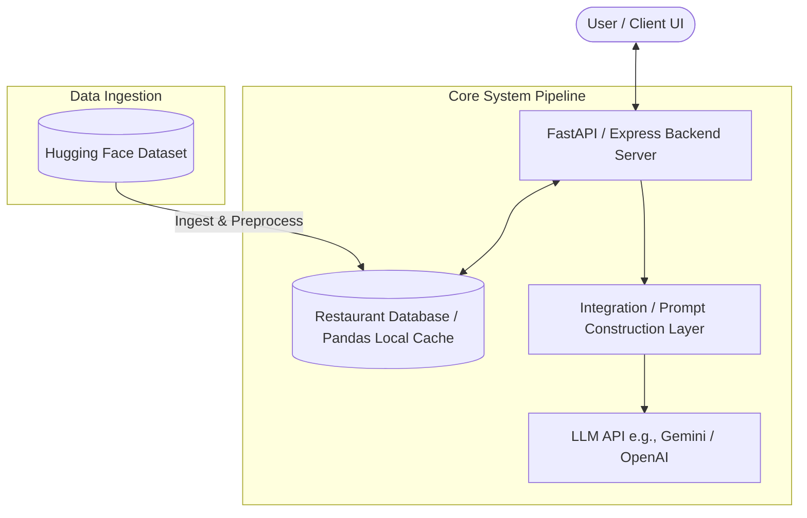
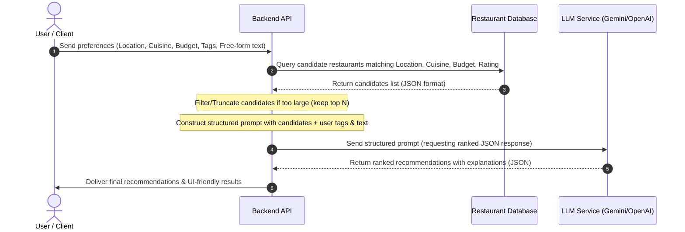

# System Architecture: AI-Powered Restaurant Recommendation System

This document outlines the detailed system architecture, data flow, component design, API interfaces, and technology stack for the AI-Powered Restaurant Recommendation System (Zomato Use Case).

---

## 1. System Overview

The application is designed to recommend restaurants by combining **deterministic database filtering** (for hard constraints like location, budget, cuisine, and minimum rating) with **Large Language Model (LLM) reasoning** (for soft/optional constraints like "family-friendly", "romantic", or "serves free cake" and generating human-like explanations).



---

## 2. Architecture Components

### 2.1. Client / Frontend UI
* **Role:** Collects user preferences and displays recommendations.
* **Inputs:** 
  * Location, Budget Tier, Cuisine, Minimum Rating (Hard Filters).
  * Feature Tag Checkboxes (Family-friendly, Pure Veg, Serves Alcohol, etc.).
  * Free-form text input (for custom requirements).
* **Outputs:** Interactive cards displaying restaurant names, cuisines, ratings, estimated cost, and the AI-generated personalized explanation.

### 2.2. Backend / API Gateway
* **Role:** Orchestrates the flow, queries the database, executes the prompt engineering, and interfaces with the LLM.
* **Framework:** Python (FastAPI/Flask) or Node.js. Python is highly recommended to leverage data science libraries (Pandas/NumPy) for dataset preprocessing.

### 2.3. Data Ingestion & Storage
* **Source:** Hugging Face Zomato Restaurant Recommendation dataset.
* **Storage Options:**
  * **Option A (Lightweight):** Pandas DataFrame cached in memory (since the dataset is small enough to load into RAM).
  * **Option B (Robust):** SQLite / PostgreSQL with full-text search capability.
* **Preprocessing:** Normalize location names, map average costs to budget tiers (Low, Medium, High), and convert ratings to numeric formats.

### 2.4. Integration Layer (Prompt Builder)
* **Role:** Translates database query results and user preferences into a structured LLM prompt.
* **Process:**
  1. Retrieve matching candidate list from the database using hard filters.
  2. If the candidate list is too large (e.g. >15), sort and truncate by rating and popularity to fit the LLM context window.
  3. Format candidate restaurants into JSON/Markdown format for the prompt.
  4. Inject user preferences and request a structured JSON response from the LLM.

### 2.5. LLM Recommendation Engine
* **Role:** Performs semantic evaluation (re-ranking) of candidates based on soft/free-form preferences and writes custom explanations.
* **Configuration:** Gemini API or OpenAI API with JSON mode enabled to ensure parseable schema responses.

---

## 3. Data Flow & Pipeline



---

## 4. Database Schema (Target)

Whether stored in a relational database or managed via Pandas, the preprocessed data must conform to the following schema:

| Field Name | Type | Description |
| :--- | :--- | :--- |
| `id` | Integer | Unique identifier for the restaurant |
| `name` | String | Name of the restaurant |
| `location` | String | Normalized city / area (e.g., "Delhi", "Bangalore") |
| `cuisines` | Array[String] | Cuisines served (e.g., `["Italian", "Chinese"]`) |
| `average_cost_two` | Float | Estimated average cost for two people |
| `budget_tier` | String | Mapped budget tier: `"low"`, `"medium"`, or `"high"` |
| `aggregate_rating` | Float | Rating on a 1.0 - 5.0 scale |
| `features` | Array[String] | Extracted feature tags (e.g., `["family-friendly", "alcohol"]`) |
| `reviews_text` | String | Combined reviews text for semantic embedding / keyword search (optional) |

---

## 5. API Interface Design

### Endpoint: `POST /api/recommend`

#### Request Payload
```json
{
  "location": "Delhi",
  "budget": "medium",                      // Optional. Choices: "low", "medium", "high", "any", or "" (default)
  "cuisine": "Italian",                     // Optional. Choices: cuisine name, "any", or "" (default)
  "min_rating": 4.0,
  "options": ["family-friendly", "pure vegetarian"],
  "custom_preferences": "romantic rooftop setting, serves eggless cake"
}
```

#### Response Payload (JSON)
```json
{
  "status": "success",
  "total_recommended": 3,
  "recommendations": [
    {
      "restaurant_name": "Bella Italia",
      "cuisine": "Italian",
      "rating": 4.5,
      "estimated_cost_for_two": 1200,
      "ai_explanation": "Bella Italia matches your craving for Italian and fits your medium budget. It offers a beautiful romantic rooftop ambiance as requested, features a family-friendly layout, and confirmed they serve eggless cakes."
    },
    {
      "restaurant_name": "Little Italy",
      "cuisine": "Italian, Pizza",
      "rating": 4.2,
      "estimated_cost_for_two": 950,
      "ai_explanation": "Little Italy matches your Italian cuisine criteria and is fully vegetarian (matching your pure vegetarian filter). While not on a rooftop, they are highly rated for romantic couple dinners."
    }
  ]
}
```

---

## 6. Prompt Engineering & LLM Integration Strategy

To ensure reliability, the integration layer uses a structured system instruction and JSON output constraint.

### System Instructions
```text
You are a Zomato Restaurant Recommendation AI assistant.
Your task is to rank the candidate restaurants provided and explain why they match the user's specific request.

CRITICAL RANKING METRICS:
1. Prioritize restaurants matching optional preset filters (e.g., family-friendly, pure vegetarian).
2. Rank highly those matching the user's custom free-form preferences (e.g., rooftop, serves cake).
3. Consider aggregate ratings.

OUTPUT SCHEMA:
Provide your final recommendations in a valid JSON format only, matching this structure:
{
  "recommendations": [
    {
      "restaurant_name": "Name",
      "cuisine": "Cuisine",
      "rating": 4.X,
      "estimated_cost_for_two": X,
      "ai_explanation": "Concise reasoning connecting user constraints to restaurant attributes."
    }
  ]
}
Do not add markdown formatting outside of the JSON block.
```

### Context Prompt Template
```text
User Request:
- Location: {location}
- Budget: {budget}
- Cuisine: {cuisine}
- Min Rating: {min_rating}
- Selected Options: {options}
- Custom Preferences: {custom_preferences}

Candidate Restaurants (Pre-filtered by DB):
{candidate_restaurants_json}

Please analyze these candidates, select the top 3-5 best matching candidates, rank them, and return the JSON response.
```

---

## 7. Technology Stack Recommendations

* **Frontend:** React / Next.js with Tailwind CSS or Vanilla CSS for a premium, responsive user interface.
* **Backend:** Python with FastAPI for fast asynchronous API execution and simple integration with Pandas and the Hugging Face hub library.
* **Dataset Loader:** Hugging Face `datasets` python library.
* **LLM Client:** Google GenAI SDK (Gemini 1.5 Flash or Pro) for fast latency and high-quality structured JSON output.
