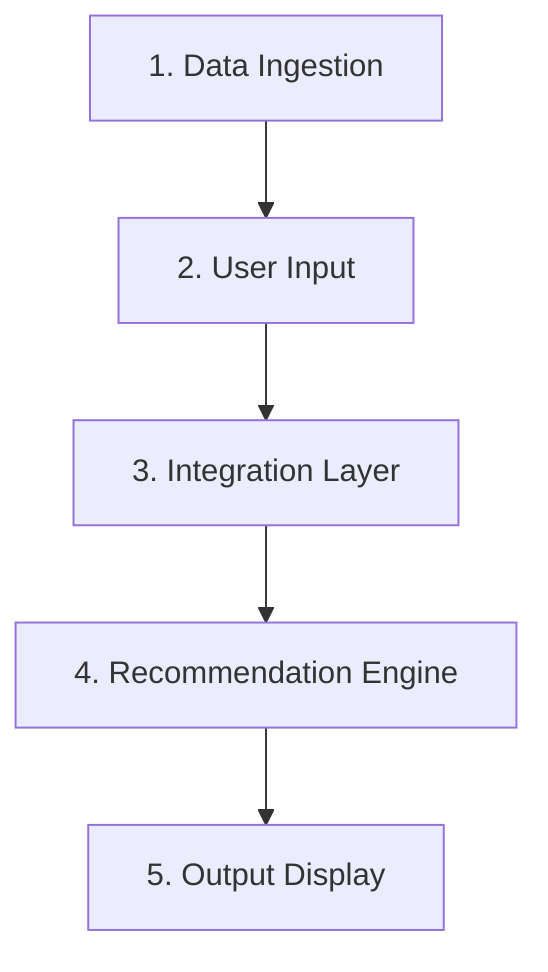

# Project Context: AI-Powered Restaurant Recommendation System (Zomato Use Case)

This document provides the context, objectives, system workflow, and requirements for the AI-Powered Restaurant Recommendation System, as outlined in [problemstatement.txt](file:///c:/Users/tarun/Desktop/Tarun%20Gupta/NextLeap/Restaurant%20Recommender%20-%20Anti%20Gravity/docs/problemstatement.txt).

---

## 1. Project Objective

The goal is to design and implement an AI-powered restaurant recommendation service (inspired by Zomato) that:
1. Receives structured user preferences (such as location, budget, cuisine, ratings, and optional filters).
2. Leverages a real-world Zomato restaurant dataset.
3. Integrates with a Large Language Model (LLM) to reason, rank, and generate personalized, human-like recommendations with clear explanations.
4. Displays the final recommended choices in a clean, user-friendly format.

---

## 2. System Workflow

The system is structured around five main stages:

### 2.1. Data Ingestion
* **Data Source:** [Zomato Restaurant Recommendation Dataset on Hugging Face](https://huggingface.co/datasets/ManikaSaini/zomato-restaurant-recommendation)
* **Ingestion Tasks:**
  * Load and preprocess the dataset.
  * Extract key fields including:
    * Restaurant Name
    * Location
    * Cuisine
    * Cost / Average Cost for Two
    * Rating
    * Other relevant metadata

### 2.2. User Input
The application collects user preferences using location, ratings, and optional filters:
* **Mandatory Filter:**
  * **Location:** (e.g., Delhi, Bangalore, etc.)
* **Core Filters (Optional):**
  * **Budget:** Grouped into tiers (Low, Medium, High, or Any)
  * **Cuisine:** (e.g., Italian, Chinese, Indian, or Any)
  * **Minimum Rating:** (e.g., 3.5+, 4.0+)
* **Optional Preset Options (Checkboxes/Multi-select):**
  * Family-friendly
  * Quick service
  * Pure vegetarian
  * Spicy Food
  * Serves Alcohol
  * *None of these*
* **Optional Free-form Preferences:**
  * Custom text prompt (e.g., *"Couple friendly"*, *"Serves free cake"*, *"Rooftop seating"*).

### 2.3. Integration Layer
* **Filtering:** Filters the dataset based on hard constraints (e.g., matching location, and optionally budget category, cuisine type, and minimum rating) to find a relevant subset of candidate restaurants.
* **Prompt Preparation:** Formats the structured candidate restaurant details and user preferences into a structured LLM prompt.
* **Prompt Design:** Instructs the LLM on how to evaluate options, apply soft/optional constraints, rank candidates, and provide explanations.

### 2.4. Recommendation Engine (LLM)
The LLM serves as the reasoning core of the system:
* **Ranking:** Re-ranks the filtered candidate list to best match all user inputs (including the optional/free-form inputs).
* **Explanation:** Provides a personalized justification for each recommended restaurant, explaining exactly why it aligns with the user's choices.
* **Summarization:** (Optional) Offers a summary of the overall recommendations to guide the user's decision.

### 2.5. Output Display
Presents the top recommended restaurants in a clear UI containing:
* **Restaurant Name**
* **Cuisine**
* **Rating**
* **Estimated Cost**
* **AI-generated explanation** (explaining the reasoning behind the recommendation)
